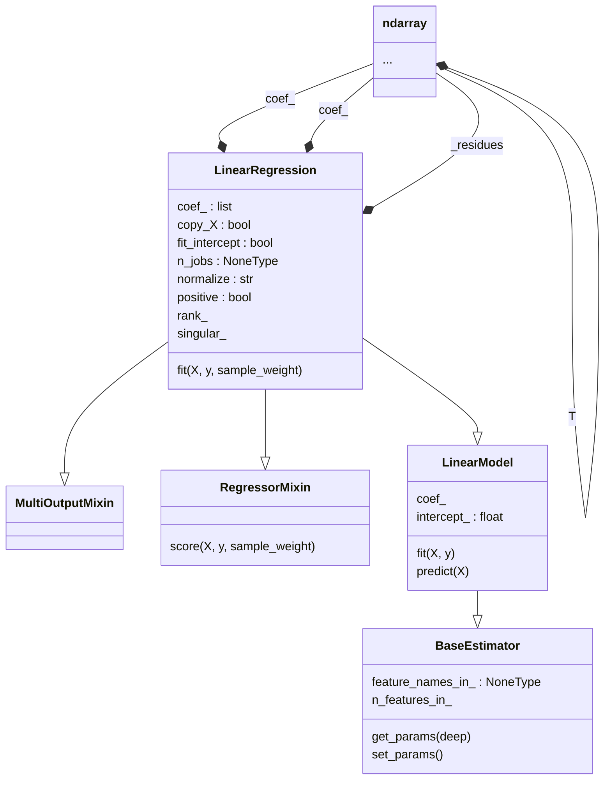

# ProML

### 1. Supervised Learning

#### 1.1.1. Ordinary Least Square 

```mermaid
classDiagram
  class ndarray {
   ...
  }
  class BaseEstimator {
    feature_names_in_ : NoneType
    n_features_in_
    get_params(deep)
    set_params()
  }
  class MultiOutputMixin {
  }
  class RegressorMixin {
    score(X, y, sample_weight)
  }
  class LinearModel {
    coef_
    intercept_ : float
    fit(X, y)
    predict(X)
  }
  class LinearRegression {
    coef_ : list
    copy_X : bool
    fit_intercept : bool
    n_jobs : NoneType
    normalize : str
    positive : bool
    rank_
    singular_
    fit(X, y, sample_weight)
  }
  LinearModel --|> BaseEstimator
  LinearRegression --|> MultiOutputMixin
  LinearRegression --|> RegressorMixin
  LinearRegression --|> LinearModel
  ndarray --* ndarray : T
  ndarray --* LinearRegression : coef_
  ndarray --* LinearRegression : coef_
  ndarray --* LinearRegression : _residues
```

#### 1.1.2. Ridge Regression

Coming soon.

#### 1.1.3. Lasso Regression

Coming soon.
