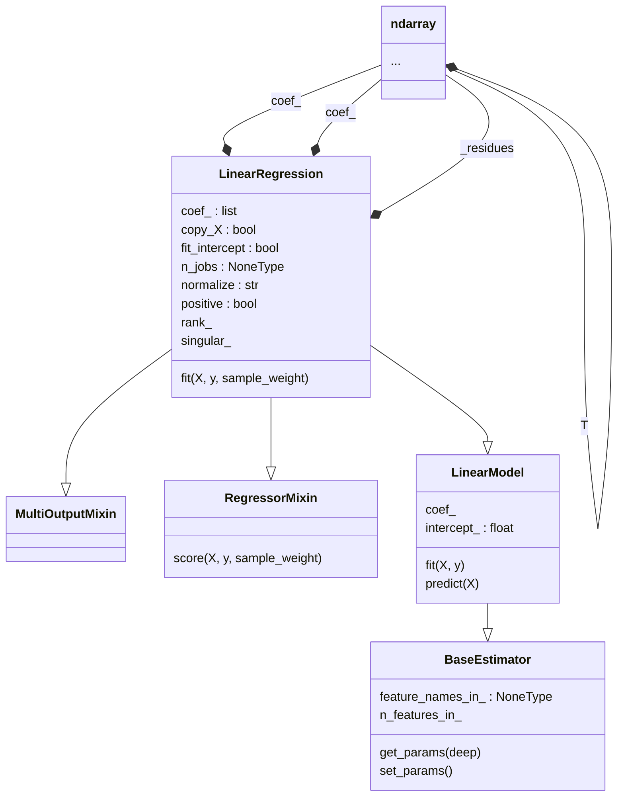
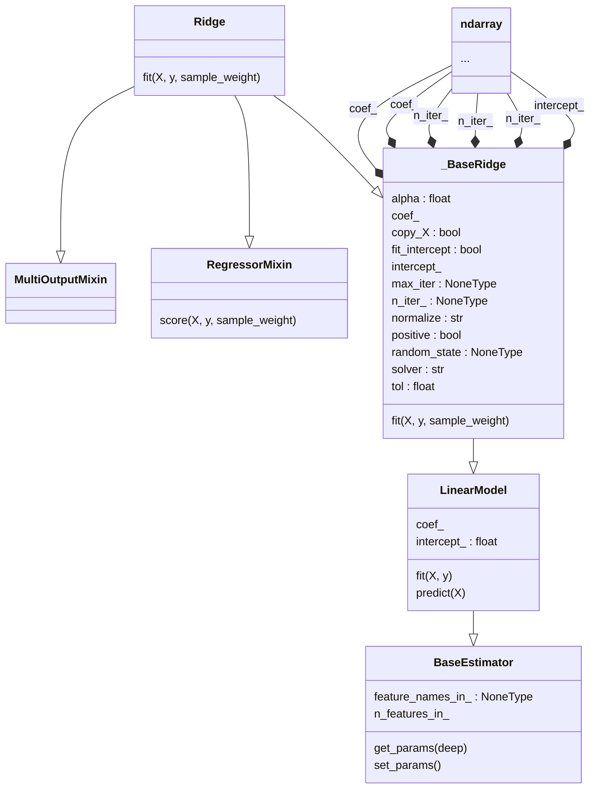
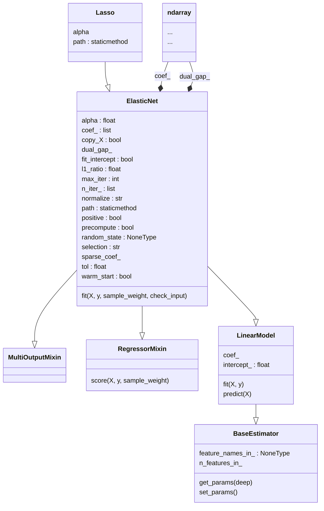

	

 
 

# ProML

### 1. Supervised Learning

#### 1.1.1. Ordinary Least Square 

> **Detour**
>  - [R-squared (coefficient of determination) and Adjusted R-Squared score](https://excalidraw.com/#json=vhWfaD5v_fdHjDh8oBtaS,mLix-LNId2pfmu0gVll5DQ)
>  - TODO: Adjusted R-squared score

#### 1.1.2. Ridge Regression

#### 1.1.3. Lasso Regression

